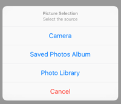

# GEImagePicker (Swift)
[](https://github.com/geitoodevs/GEImagePicker)
[](https://github.com/geitoodevs/GEImagePicker)
[](https://github.com/geitoodevs/GEImagePicker)

Easy image picker - Closure callback with status - Permission Check - Action Sheet tool

You can easily pick a picture from your Camera, Album or Library in one call and a **closure as response** with the picture selected and the final status. You can also decide if you want to let the user crop the picture or not (**editMode**).

In addition this tool will check the app **permissions** for accessing to the Camera or Library and it will let you go to the application settings panel in order to get them activated.

It was added an **actionsheet** for making easier the selection of the picture.



## Usage
You only need to add the GEImagePicker.swift file to your project and start using the available methods.

To use it in your own project

* Directly setting the source:

```swift
// In this case we are going to pick a picture from PhotoLibrary and
// I will be able to crop it because I set the editMode to true

GEImagePicker.pickImage(.photoLibrary, whereViewController: self, editMode: true) { (image, status) -> () in

    switch status {
        case .cancelled:
            print("Cancelled")
            break
        case .noSource:
            print("No source")
            break
        case .notPermission:
            print("No permissions")
            break
        case .ok:
            print("OK")
            break

    }
}
```

* Throughout the action sheet tool

```swift
GEImagePicker.pickImageActionSheet(self, editMode: true) { (image, status) -> () in

    switch status {

        case .cancelled:
            print("Cancelled")
            break
        case .noSource:
            print("No source")
            break
        case .notPermission:
            print("No permissions")
            break
        case .ok:
            print("OK")
            break

    }
}

```

## Info
* We can receive several status from the callback:

```swift
enum GEImagePickerStatus {
    case ok
    case cancelled
    case noSource
    case notPermission
}
```

* In addition you can select the source for picking the picture

```swift
enum GEImagePickerSource {
    case camera
    case savedPhotosAlbum
    case photoLibrary
}
```


## Requirements

iOS 8.0

## Installation
Copy GEImagePicker.swift file to your project and start using the functions available.

## Author

Miguel Rodríguez, www.miguelios.com

## License

GEImagePicker is available under the MIT license. See the LICENSE file for more info.
